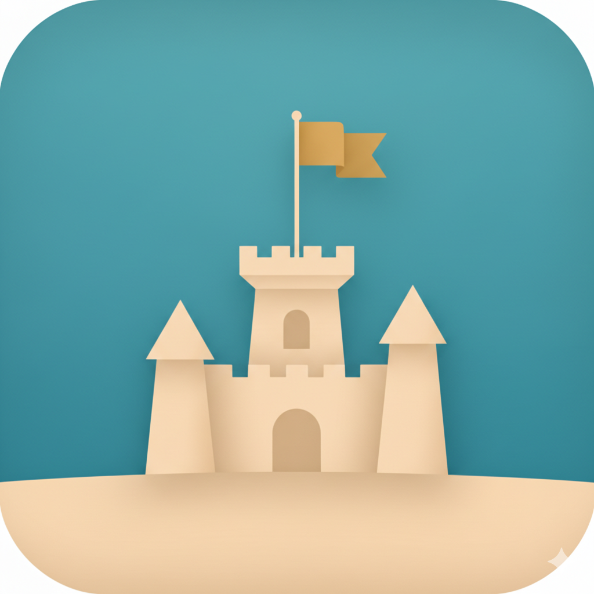

<p align="center">
  
</p>

<h1 align="center">Sand Festival</h1>

<p align="center">macOS dashboard for many parallel Claude Code sessions.</p>

---

Sand Festival replaces "many Terminal tabs each running `claude` in a different
project" with a single window: a sidebar listing every project, a real
embedded terminal for the selected one, and a menu bar item that tells you
which sessions are waiting on you. Sessions live for as long as the app does;
when something needs your attention, you see it at a glance and jump in with
one click.

## Install

```sh
brew install --cask rosenbjerg/sandfestival/sandfestival
```

The long form auto-taps the formula repo — no separate `brew tap` step needed.

### Requirements

- macOS 26 (Tahoe) or later
- [Claude Code](https://docs.claude.com/en/docs/claude-code/) on your `PATH`
- *(optional)* a sandbox wrapper such as `nono` if you want Claude Code to
  run sandboxed — the per-project command and args are user-editable, so any
  wrapper works (or none)

### Update / uninstall

```sh
brew upgrade --cask sandfestival
brew uninstall --cask sandfestival            # leaves user data in place
brew uninstall --zap --cask sandfestival      # also removes projects, prefs, caches
```

## What it does

- **One session per project, all running in parallel.** Each gets its own
  embedded terminal with persistent scrollback. Switching projects is instant
  because nothing is torn down.
- **Hook-based status detection.** Sand Festival installs lightweight hook
  entries in `~/.claude/settings.json` so it knows exactly when a session
  starts, finishes a turn, or is waiting on you — no PTY scraping, no
  guessing.
- **Menu bar attention indicator.** A single glance tells you whether any
  session needs input. Click to jump straight to that project.
- **Drag-to-reorder sidebar.** Or let the most recently active project float
  to the top automatically.
- **Token-scoped local listener.** The hook receiver binds to
  `127.0.0.1:51789` and validates a per-install bearer token stored in the
  macOS Keychain. The token is never written to `settings.json`.

## How it works

Architecture details live in [SPEC.md](SPEC.md). In short: an agent-neutral
`Core` (session manager, state machine, project store) plus a `ClaudeCode`
adapter that owns the hook listener and the merge of hook entries into
`~/.claude/settings.json`. Adding another agent would mean writing a sibling
adapter, not touching `Core`.

## Building from source

Open `SandFestival.xcodeproj` in Xcode and run the `SandFestival` scheme.
Requires Xcode 26 or later (matches the macOS 26 deployment target).

For a reproducible signed/notarized build, see
[`scripts/README.md`](scripts/README.md) and `scripts/release.sh`.

## Project status

Pre-1.0. Working day-to-day for the author but expect rough edges and
occasional breaking changes between releases.
